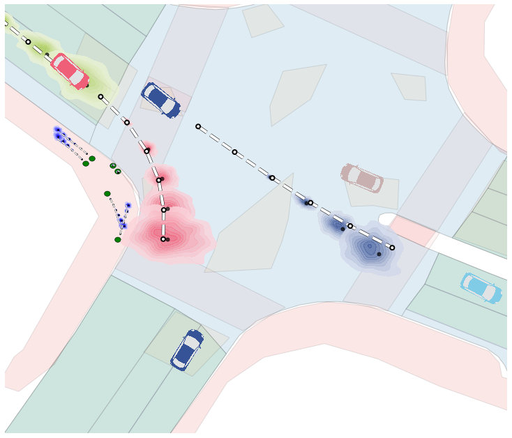
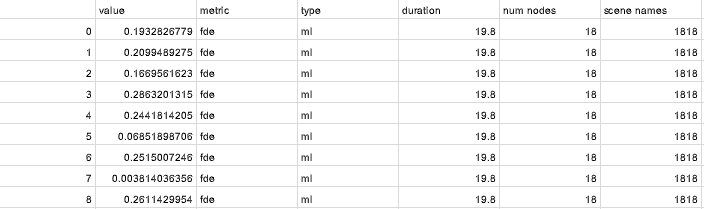
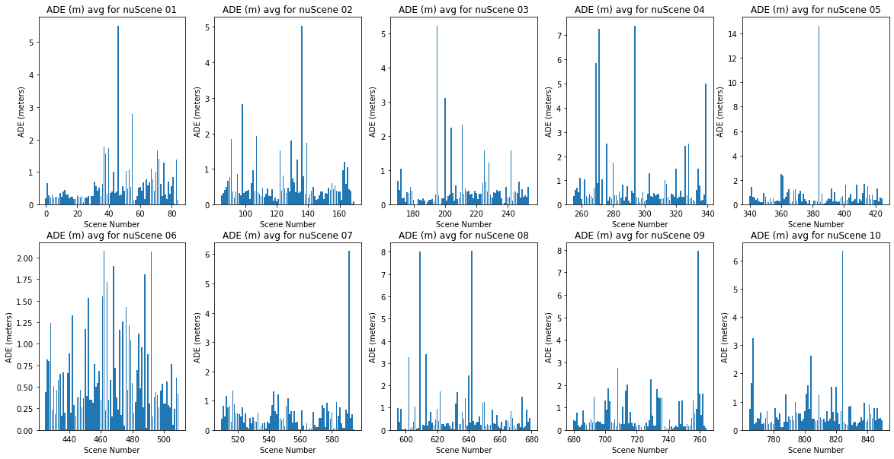

# MAVRIC Trajectron Evaluation on NuScenes, Lyft, Argoverse, and Waymo Dataset Winter 2020
~ Nam Gyu Kil   
  
*Plots of trajectories predicted using Trajectron++ running NuScenes Qualitative.ipynb*

## Project Goal
This project is to apply the [Trajectron++ code](https://github.com/StanfordASL/Trajectron-plus-plus) for vehicle trajectory predictions on various datasets. The four datasets that we tested Trajectron++ were NuScenes, Lyft, Argoverse and Waymo. The databases contain information on the ego vehicle, as well other vehicles and pedestrians for every timestep. The scenes for the databases range from 10-30 seconds. The databases have been recorded in different frequencies and the table below shows information on the dataset used for this evaluation.

| Name  | Number of Scenes | Data Size (hrs) | Scene Duration (sec) | Recording Frequency (Hz) |  
| --- | --- | --- | --- | --- |
| NuScenes | 1000 | approx 5.5 | 20 | 2 | 
| Lyft | 366 | approx 2.5 | 25 | 5 |
| ArgoVerse | 113 | approx 1 | 15-30 | 5 | 
| Waymo | 1150 | approx 6.4 | 20 |  10 |

The databases all have their own unique format which have been converted to a common format using [MAVRIC 2020 Summer Project](https://github.com/jskumaar/MAVRIC_Interaction_Modeling). This github page has the links to download the NuScenes, Lyft, Argoverse, and Waymo dataset. To run the jupyter notebook .ipynb files in this repository, you must first have the .csv files generated from conversion file in the [MAVRIC 2020 Summer Project](https://github.com/jskumaar/MAVRIC_Interaction_Modeling) 

This standard format is stored in a .csv file which is then processed into .pkl and fed into the Trajectron++ pipeline as input. 

## How to run the code
Before running this code, users must first download databases they are interested in ([NuScenes](https://www.nuscenes.org/), [Lyft](https://self-driving.lyft.com/level5/data/), [Argoverse](https://www.argoverse.org/), and [Waymo](https://waymo.com/open/data/)). Then process the data into a common format using  [MAVRIC 2020 Summer Project](https://github.com/jskumaar/MAVRIC_Interaction_Modeling). The .csv files should then be stored in [/experiments/data/data](/experiments/data/data) in respective folder (nuScenes, Lyft, Argoverse, Waymo).  
  
The code is stored in the folder [experiments/MAVRIC](experiments/MAVRIC) as Jupyter Notebook files ./ipnb. There are multiple notebook which does the following:

### 1_process_data_MAVRIC.ipynb
This Jupyter Notebook file invokes the [process_data_MAVRIC.py](experiments/process_data_MAVRIC.py) function. This function is modifed from the original Trajectron++ github repository to account for common format used for the multiple datasets. The input to the process_data_MAVRIC.py are the common format .csv and the output are .pkl files necessary for evaluation of the Trajectron++ algoritm. The .pkl files should then be stored in  [/experiments/data/processed](/experiments/data/processed) in respective folder (nuScenes, Lyft, Argoverse, Waymo).  Below is a sample snipped of the .csv outputed by running this jupyter notebook file.

| Scene ID  | Frame ID | Obj Type | Obj ID | x,y,z (m) | quaternoin | x_dot, y_dot, z_dot(m/s) |
| --- | --- | --- | --- | --- | --- | --- |
| 0 | 0 | vehicle | 0 | -0.2, 16.2, 0.7 | -0.63, 0.01, 0.01, -0.7 | 0.0, 0.0, 0.0, 0.0 |
| ... | ... | ... | ... | ... | ... | ... |

### 2_evaluate_dyna4_veh.ipnb
This Jupyter Notebook file invokes the [evaluate_MAVRIC.py](experiments/evaluate_MAVRIC.py) function. This function is modified from the original Trajectron++ github repository as the output .csv file.  
`python evaluate_MAVRIC.py --model models/int_ee --checkpoint=12 --data ./data/processed/nuScenes/nuScenes_01_full.pkl --output_path ./data/results/DYNAMICS_INTEGRATION/4sec/VEHICLE/nuScenes/01 --output_tag int_ee --node_type VEHICLE --prediction_horizon 4`   
The inputs to evaluate_MAVRIC.py are the following:
- model
- checkpoint
- data
- output path
- output tag
- node type
- prediction horizon
  
*Screenshot of fde_most_likely_z.csv for Waymo Dataset 0029*

### 3_plotbar_dyna4_veh.ipynb
  
*FDE/ADE Bar Plots for NuScenes*
